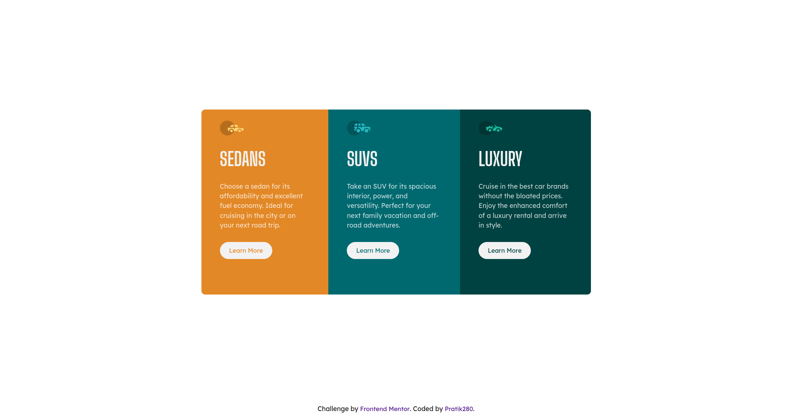

# Frontend Mentor - 3-column preview card component solution

This is a solution to the [3-column preview card component challenge on Frontend Mentor](https://www.frontendmentor.io/challenges/3column-preview-card-component-pH92eAR2-). Frontend Mentor challenges help you improve your coding skills by building realistic projects. 

## Table of contents

- [Overview](#overview)
  - [The challenge](#the-challenge)
  - [Screenshot](#screenshot)
  - [Links](#links)
- [My process](#my-process)
  - [Built with](#built-with)
  - [What I learned](#what-i-learned)
  - [Useful resources](#useful-resources)
- [Author](#author)

## Overview

### The challenge

Users should be able to:

- View the optimal layout depending on their device's screen size
- See hover states for interactive elements

### Screenshot

### Links

- Source Code: [Github](https://github.com/Pratik280/3-column-preview-card-component-main)
- Live Site : [https://pratik280.github.io/3-column-preview-card-component-main/](https://pratik280.github.io/3-column-preview-card-component-main/)

## My process

### Built with

- Semantic HTML5 markup
- CSS custom properties
- Flexbox
- Mobile-first workflow

### What I learned

This is project I used css clamp() property for responsive font and also used css min() property to set width to card element

### Useful resources

- [Kevin Powell Youtube video](https://youtu.be/U9VF-4euyRo) - In this video Kevin Powell explains css properties min(), max() and clamp()
- [MDN Web Docs clamp()](https://developer.mozilla.org/en-US/docs/Web/CSS/clamp())
- [MDN Web Docs min()](https://developer.mozilla.org/en-US/docs/Web/CSS/min())

## Author

- Frontend Mentor - [@Pratik280](https://www.frontendmentor.io/profile/Pratik280)
